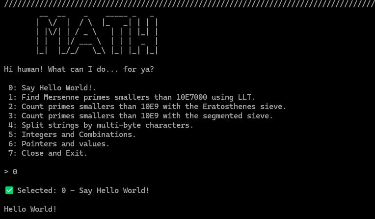

### Abstract

A simple `C` project using `docker` and `Makefile` created to practice.

### Usage

- `make compile` to compile the image
- `make run` to run the last image built
- `make compile run` to run and compile.

